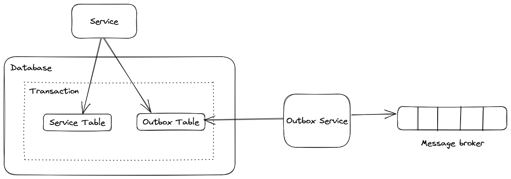

# Outbox Pattern (Transactional Outbox pattern)

## Overview

Microservice architectures are becoming increasingly popular and show promise in solving problems like scalability,
maintainability, and agility, especially in large applications. But this architectural pattern also introduces 
challenges when it comes to data handling. In distributed applications, each service independently maintains the data
it needs to operate in a dedicated service-owned datastore. To support such a scenario, you typically use a messaging
solution like RabbitMQ, Kafka, or Azure Service Bus that distributes data (events) from one service via a messaging bus
to other services of the application. Internal or external consumers can then subscribe to those messages and get 
notified of changes as soon as data is manipulated.

This approach works well until an error occurs between saving the order object and publishing the corresponding event.
Sending an event might fail at this point for many reasons:

    Network errors
    Message service outage
    Host failure

Whatever the error is, the result is that the event can't be published to the message bus. Other services won't be notified.

## Outbox patten

There's a well-known pattern called Transactional Outbox that can help you avoid these situations. It ensures events 
are saved in a datastore (typically in an Outbox table in your database) before they're ultimately pushed to a message
broker. 

If the business object and the corresponding events are saved within the same database transaction, it's guaranteed 
that no data will be lost. Everything will be committed, or everything will roll back if there's an error.

## How this library can help you

Generally when you need to use the outbox pattern you have to create Outbox table and Outbox consumer which will read 
the message from the Outbox table and publish it to message broker. Outbox table generally store the serialize 
information of the message we need publish.

This library provides a Outbox consumer which is written in .NET and uses EF Core to read the Outbox table. You can use
the docker image which allows you to deploy the Outbox consumer.

As of now library only supports RabbitMQ message broker but would continue grow and allow you to configure different types
of message broker. 

In case you need to customize, you can use the `Outbox.Core` NuGet package and write your you custom implementation. 